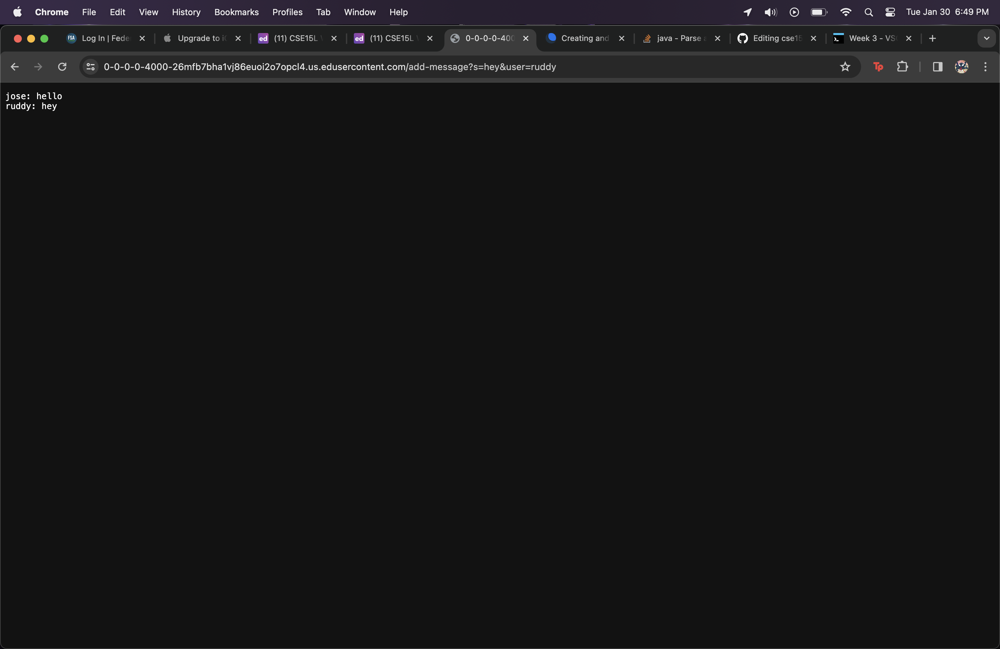
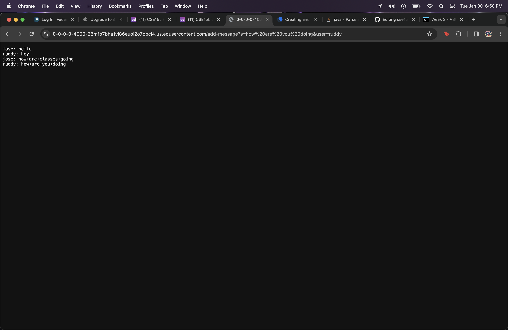
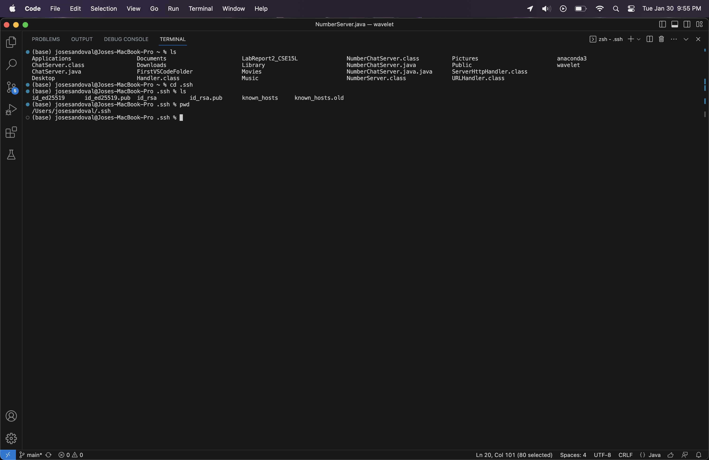
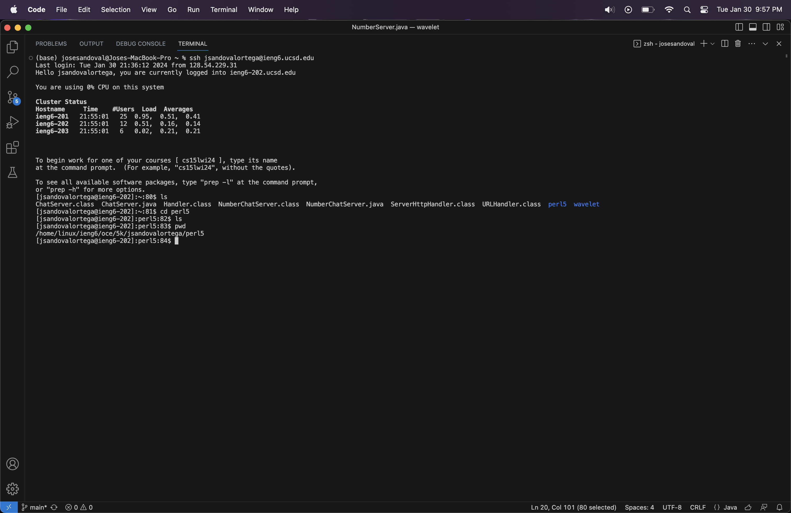

# Lab Report 2 
# Part One =)
## Code for ChatServer.java
```
import java.io.IOException;
import java.net.URI;

class Handler implements URLHandler {
    // The one bit of state on the server: a number that will be manipulated by
    // various requests.
    String string = "";

    public String handleRequest(URI url) {
        if (url.getPath().equals("/")) {
            return string;
        } else {
            if (url.getPath().contains("/add-message")) {
                String[] parameters = url.getQuery().split("=");
                parameters = url.getQuery().split("&|=");
                
                if (parameters[0].equals("s")) {
                    string += parameters[3]+": ";
                    string+= parameters[1]+"\n";
                    return string;
                }
            }
            return "404 Not Found!";
        }
    }
}

class NumberChatServer {
    public static void main(String[] args) throws IOException {
        if(args.length == 0){
            System.out.println("Missing port number! Try any number between 1024 to 49151");
            return;
        }

        int port = Integer.parseInt(args[0]);

        ChatServer.start(port, new Handler());
    }
}
```
## Code for NumberChatServer.java
```
// A simple web server using Java's built-in HttpServer

// Examples from https://dzone.com/articles/simple-http-server-in-java were useful references

import java.io.IOException;
import java.io.OutputStream;
import java.net.InetSocketAddress;
import java.net.URI;

import com.sun.net.httpserver.HttpExchange;
import com.sun.net.httpserver.HttpHandler;
import com.sun.net.httpserver.HttpServer;

interface URLHandler {
    String handleRequest(URI url);
}

class ServerHttpHandler implements HttpHandler {
    URLHandler handler;
    ServerHttpHandler(URLHandler handler) {
      this.handler = handler;
    }
    public void handle(final HttpExchange exchange) throws IOException {
        // form return body after being handled by program
        try {
            String ret = handler.handleRequest(exchange.getRequestURI());
            // form the return string and write it on the browser
            exchange.sendResponseHeaders(200, ret.getBytes().length);
            OutputStream os = exchange.getResponseBody();
            os.write(ret.getBytes());
            os.close();
        } catch(Exception e) {
            String response = e.toString();
            exchange.sendResponseHeaders(500, response.getBytes().length);
            OutputStream os = exchange.getResponseBody();
            os.write(response.getBytes());
            os.close();
        }
    }
}

public class ChatServer {
    public static void start(int port, URLHandler handler) throws IOException {
        HttpServer server = HttpServer.create(new InetSocketAddress(port), 0);

        //create request entrypoint
        server.createContext("/", new ServerHttpHandler(handler));

        //start the server
        server.start();
        System.out.println("Server Started!");
    }
}

```
# Screenshots showing the implementation of the server

> Methods Called: My code calls on ```public String handleRequest(URI url)```, ```public void handle(final HttpExchange exchange) throws IOException```, and ```start();```
>Relevant Arguments: ```args[]```, and the given/not given query such as ```/add-message```.
> How Do Relevant Fields Change? The Field string changed as before this query it was an empty string. After the query was called it now holds two users: ```josesandoval``` & ```ruddy``` and two messages: "hello", "hey", "how are classes going", "how are you doing". 


> Methods Called: My code calls on ```public String handleRequest(URI url)```, ```public void handle(final HttpExchange exchange) throws IOException```, and ```start();```
>Relevant Arguments: ```args[]```, and the given/not given query such as ```/add-message```.
> How Do Relevant Fields Change? The Field string changed as before this query it was a string that held the previous messages from the image beforehand. After the query it still holds two users: ```josesandoval``` & ```ruddy``` and four messages: "hello", "hey", "how are classes going", "how are you doing".


# Part Two Grrrr
1. The absolute path to the private key for your SSH key for logging into ```ieng6```

2. The absolute path to the public key for your SSH key for logging into ```ieng6```

3. A terminal interaction where you log into your ieng6 account without being asked for a password.


# Part Three
Throughout week 2 and 3 I learned how to ```ssh``` into ```ieng6```. Following the same topic I learned how to make a key so that I no longer have to input my password when logging in. I also learned how to manipulate servers and add queries that to unique things like create a small messaging platform. 

