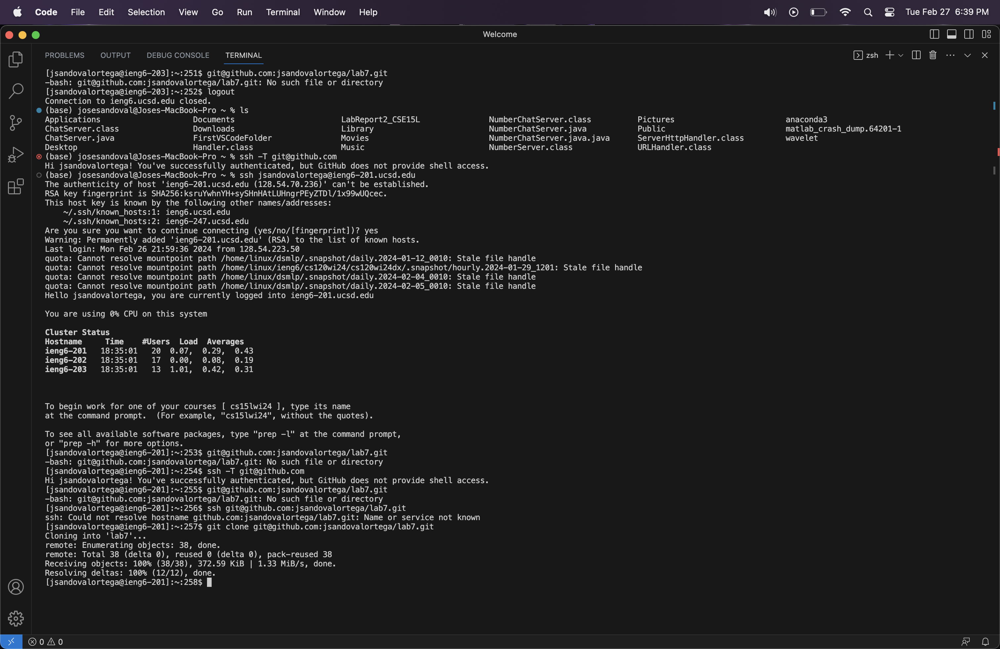

# Lab 4 Report - Vim

### Log into ieng6


Keys Pressed: ```<ssh jsandovalortega@ieng6.ucsd.edu>```\
Description: I typed this command out to log into the ieng6 server

### Clone your fork of the repository from your Github account (using the SSH URL)



Keys Pressed: ```git clone``` + ```<command + v>```\
Description: In order to clone my fork I used the command ```git clone``` and pasted the ssh from GitHub. 

### Run the tests, demonstrating that they fail

Keys Pressed: ```<command + v><command + v>```\
Description: Found the run and compile commands from week 4 and pasted them to the terminal. 

### Edit the code file to fix the failing test


Keys Pressed: ```<10w><10w><dw><i><ListExamplesTests><esc><:wq><enter>```\
Description: I jumped forward by using ```<10w>```. Then I deleted the word that was the wrong file name using ```<dw>```. 
Then I used ```<i>``` to insert the right filename. Then I went back to normal mode using ```<esc>```. Then I used ```<:wq><enter>```
to save my changes.\


Keys Pressed: ```<j><j><j><j><j><j><j><j><j><j><j><j><j><j><j><j><j><j><j><j><j><j><j><j><j><j><j><j><j><j><j><j><j><j><j><j><j><j><j><j><j><j><x><i><2><esc><:wq><enter```\
Description: Used ```<j>``` to scroll down all the way until the second while loop. I then used ```<x>``` to delete the bug, which was that the code was using ```index1``` instead of ```index2```. Then I used ```<i>``` and ```<2>``` to fix the bug. Finally I used ```<esc><:wq><enter``` to go back to normal mode, exit, and save my changes. 

### Run the tests, demonstrating that they now succeed

Keys Pressed: ```<up><up><up><enter>```\
Description: I needed to run the tests again so I went up 3 times to find the ```<bash test.sh>``` command. 

### Commit and push the resulting change to your Github account (you can pick any commit message!)

Keys Pressed: ```git add -A``` + ```git commit -m "fixed bugs"```\
Description: ```git add -A``` adds all files tracked and untracked to our commit. I did not want to individually type out all the files that were changed so this was the better option. Then I used ```<git commit -m "fixed bugs">``` to commit the files to main and added a message to describe what was done. 


