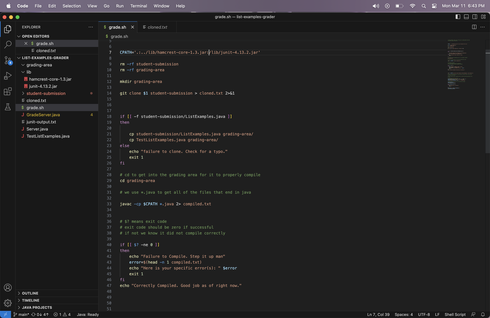
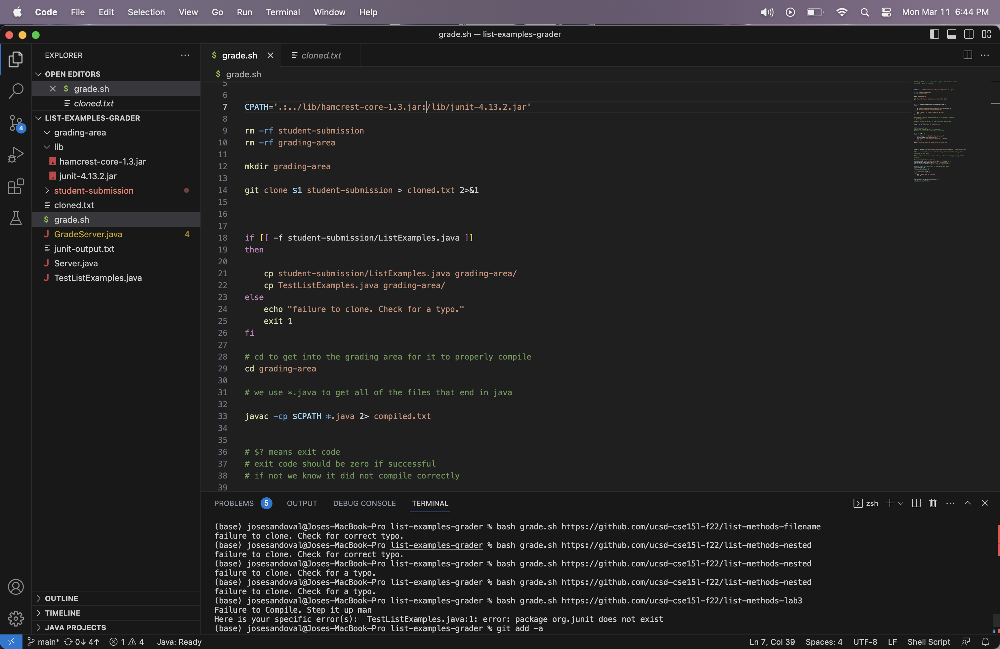
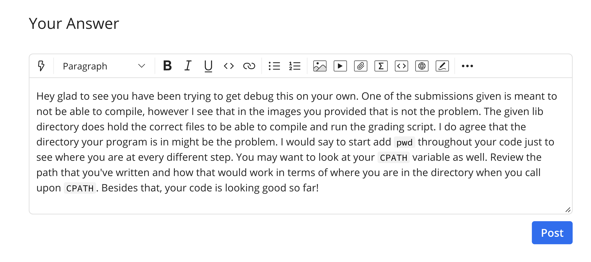
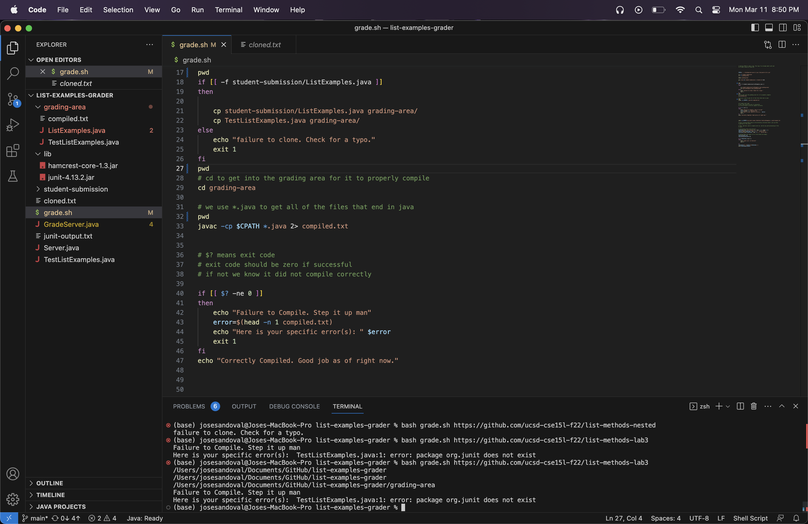

# Lab 5 Report 🙂
## Part 1 😆
### Design a debugging scenario, and write your report as a conversation on EdStem :bowtie:

1. The original post from a student with a screenshot showing a symptom and a description of a guess at the bug/some sense of what the failure-inducing input is. (Don't actually make the post! Just write the content that would go in such a post)

#### *Images From EdStem Post:*


2. A response from a TA asking a leading question or suggesting a command to try (To be clear, you are mimicking a TA here.)


3. Another screenshot/terminal output showing what information the student got from trying that, and a clear description of what the bug is.

>Description: The bug I've found is that my ```CPATH``` variable had the wrong path. The path that was there previously did not find the correct file. From where it was called directory ```grading-area``` there is no ```lib``` directory so that call wasn't reaching the ```junit-4.13.2.jar``` which is essential for the testing. The reason I did not notice this at first since the first path is correct and did reach the file needed for testing. 

4. At the end, all the information needed about the setup including:
```
File & Directory Structure

list-example-grader
->grading-area
  ->compiled.txt
  ->ListExamples.java
  ->TestListExamples.java
->lib
  ->hamcrest-core-1.3.jar
  ->junit-4.13.2.jar
->student-submission
  ->ListExamples.java
->grade.sh
->cloned.txt
->GradeServer.java
->junit-output.txt
->Server.java
->TestListExamples.java
```

- The file & directory structure needed

  

- The contents of each file before fixing the bug

  

- The full command line (or lines) you ran to trigger the bug

  >Description: Ok update I've tried the ```pwd``` thing to see where my program is at different steps. I've confirmed that I am in my grading area. So this brings me back to my original thought about the lib directory. Reviewing my CPATH variable and knowing what it represents helped me understand this bug a lot more. My bug was within my second part of the ```CPATH```. Since the first part of it was successfully going through to the lib directory and retrieving the necessary files to test the code, I assumed the same for the second path within it. However, this was an incorrect assumption and the path was not retrieving what I thought it would have.  
- A description of what to edit to fix the bug
