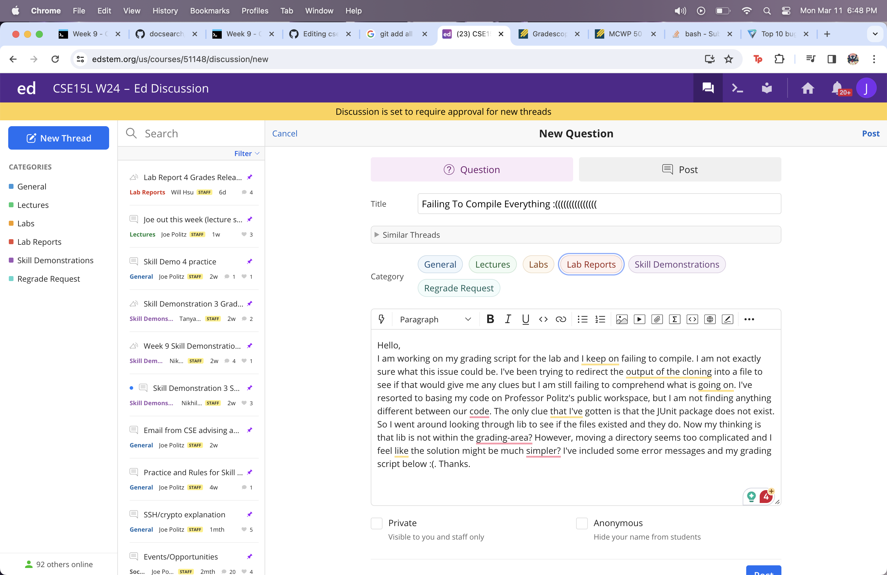

# Lab 5 Report 🙂
## Part 1 😆
### Design a debugging scenario, and write your report as a conversation on EdStem 😨

1. The original post from a student with a screenshot showing a symptom and a description of a guess at the bug/some sense of what the failure-inducing input is. (Don't actually make the post! Just write the content that would go in such a post) 😱


#### *Images From EdStem Post:* 📸


---
2. A response from a TA asking a leading question or suggesting a command to try (To be clear, you are mimicking a TA here.) 🤕


---
3. Another screenshot/terminal output showing what information the student got from trying that, and a clear description of what the bug is. 😠

>Description: The bug I've found is that my ```CPATH``` variable had the wrong path. The path that was there previously, ```/lib/junit-4.13.2.jar```, did not find the correct file. The javac command was called in the directory ```grading-area``` where there is no ```lib``` directory so that call wasn't reaching the ```junit-4.13.2.jar``` which is essential for the testing. The reason I did not notice this at first since the first path, ```../lib/ham-crest-core-1.3.jar``` is correct and did reach the file needed for testing. 

---
4. At the end, all the information needed about the setup including 😧

- The file & directory structure needed 💻

```
File & Directory Structure

list-example-grader
->grading-area
  ->compiled.txt
  ->ListExamples.java
  ->TestListExamples.java
->lib
  ->hamcrest-core-1.3.jar
  ->junit-4.13.2.jar
->student-submission
  ->ListExamples.java
->grade.sh
->cloned.txt
->GradeServer.java
->junit-output.txt
->Server.java
->TestListExamples.java
```

- The contents of each file before fixing the bug 🪰 (<- lol bug) <br>
(I believed ```grade.sh``` was the only relevant file to show as it was the only file that needed debugging 😰) 

  

- The full command line (or lines) you ran to trigger the bug 🐛

  

- A description of what to edit to fix the bug 🕷️

  >Description: Ok update I've tried the ```pwd``` thing to see where my program is at different steps. I've confirmed that I am in my grading area. So this brings me back to my original thought about the lib directory. Reviewing my CPATH variable and knowing what it represents helped me understand this bug a lot more. My bug was within my second part of the ```CPATH```. Since the first part of it was successfully going through to the lib directory and retrieving the necessary files to test the code, I assumed the same for the second path within it. However, this was an incorrect assumption and the path was not retrieving what I thought it would have.  

## Part 2 🤒
#### In a couple of sentences, describe something you learned from your lab experience in the second half of this quarter that you didn't know before:
I thoroughly enjoyed learning about debugging with jdb command as it is so helpful when understanding what is actually going on in the program. I've implemented this in my other classes like CSE12 for debugging larger programs. Learning the commands that go with it such as ```step```, ```run```, and especially ```stop at``` are super helpful. Breakpoints before a certain infinite loop have helped me program much smoother. 


