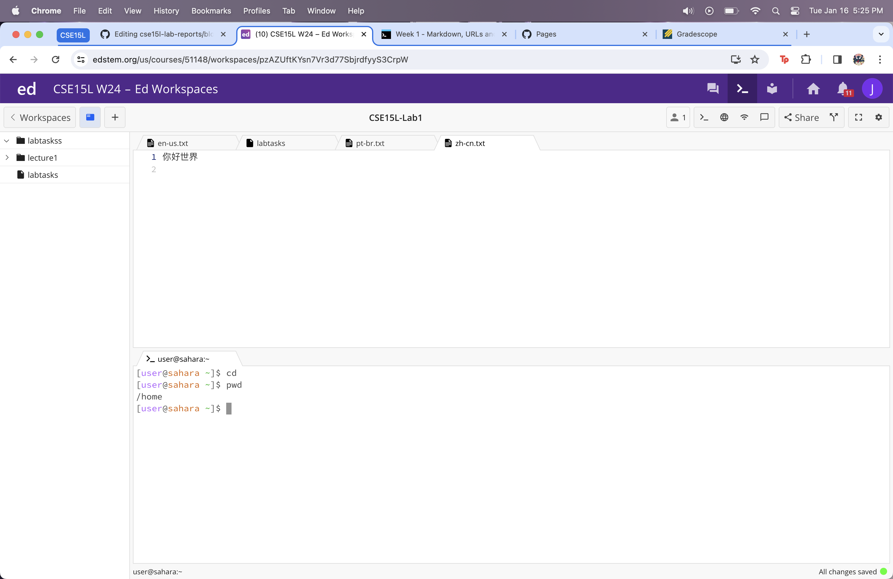
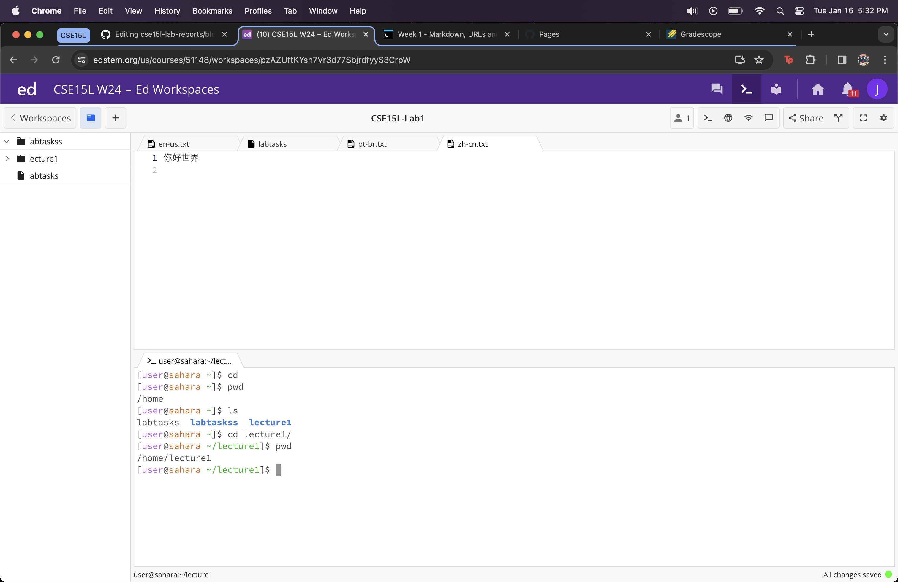
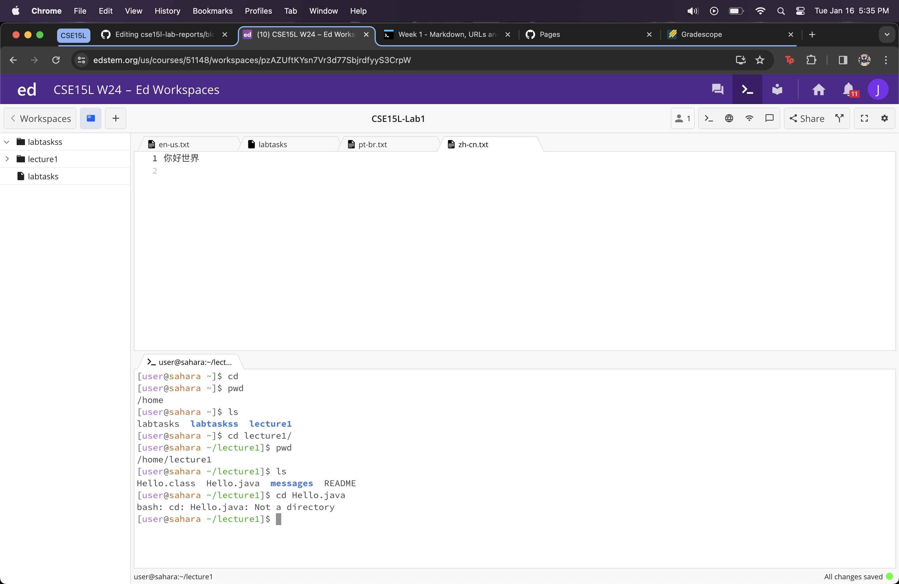
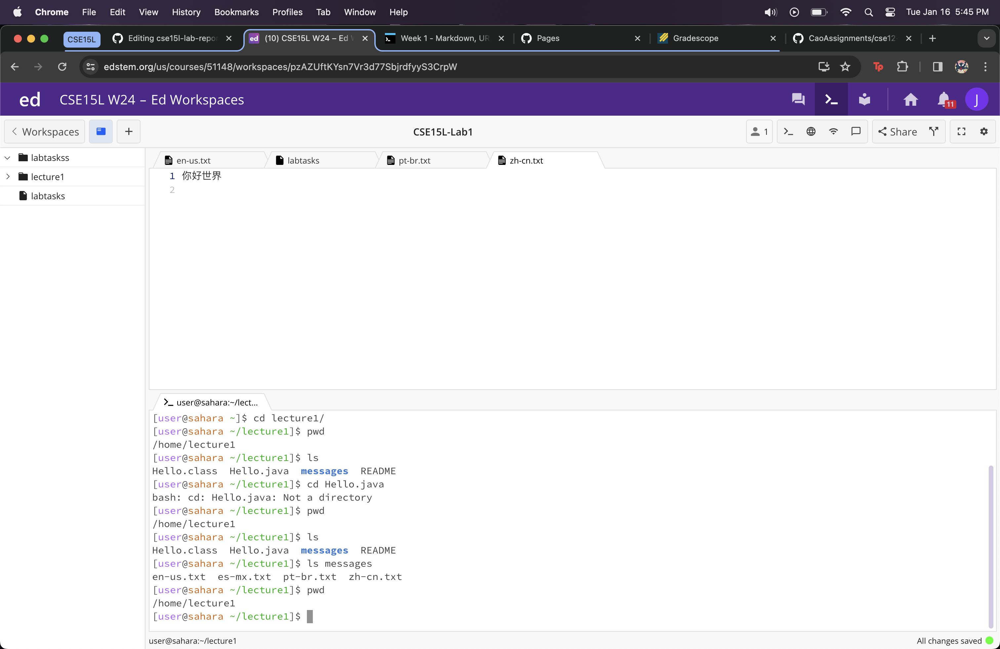
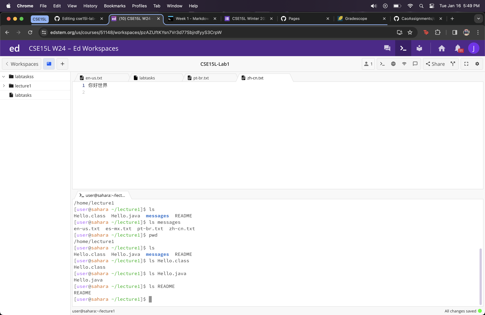
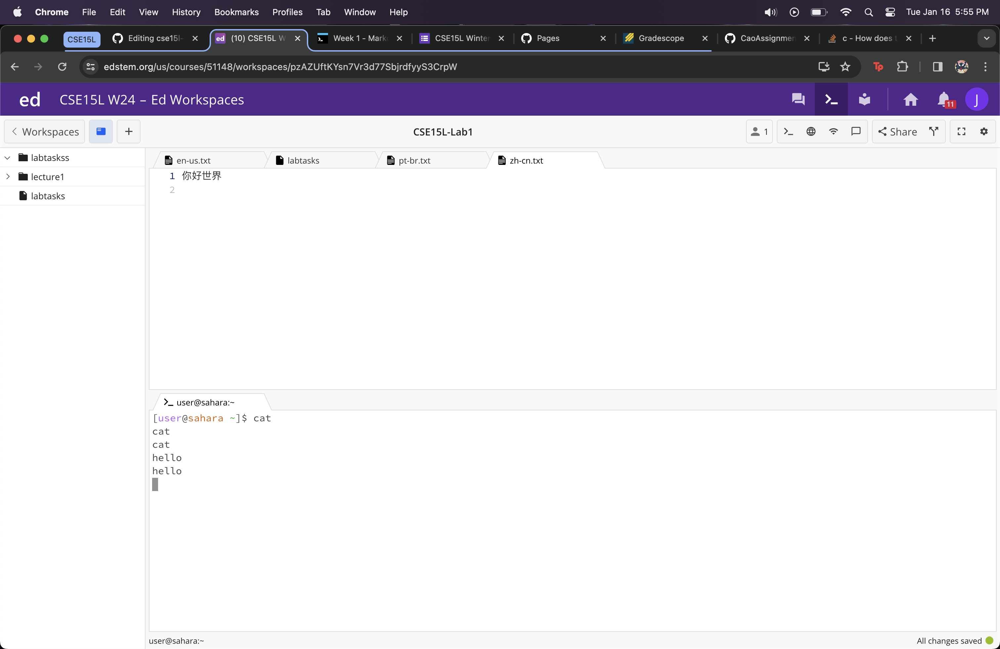
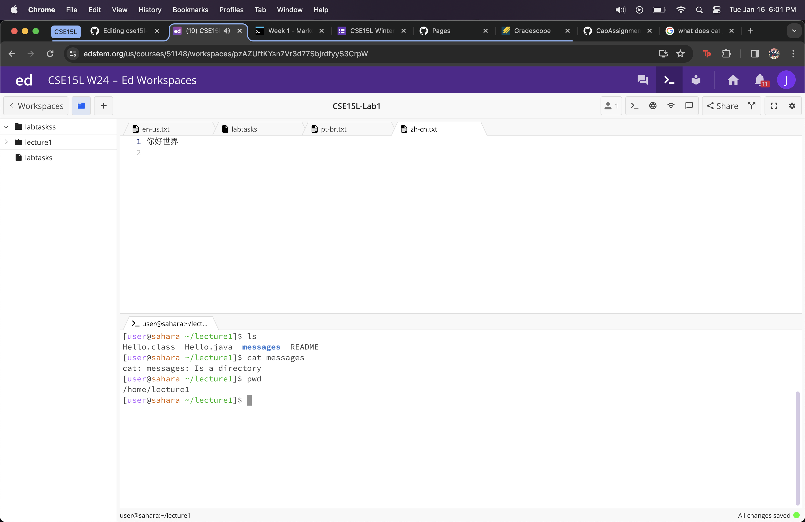
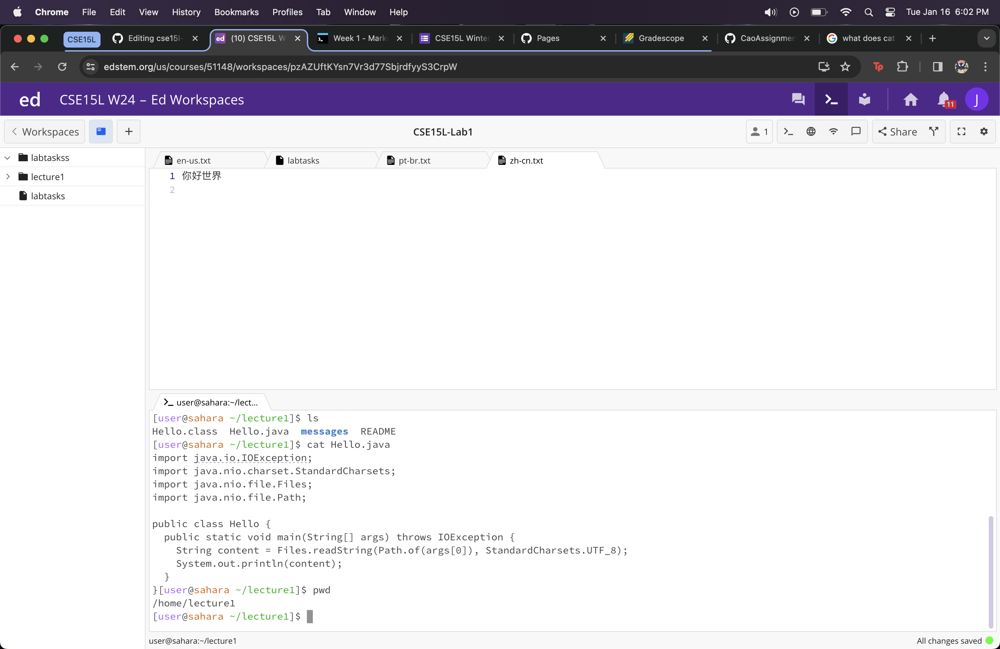

# Lab Report 1

## command ```cd```
1. Share an example of using the command with no arguments <br /> Using ```cd``` as a command with no arguments does not do anything. This was the result since this command changes directories given an argument, however there was no argument. This was not an error. The working directory was ```/home```.
2. Share an example of using the command with a path to a directory as an argument. <br /> Using ```cd``` as a command with a path to a directory changes the directory to the argument given. This is exactly how the command should work and no errors are present. The working directory after the command was ```/lecture1```.
3. Share an example of using the command with a path to a file as an argument. <br /> Using ```cd``` as a command with a path to a file as an argument causes an error, specifically ```bash: cd: Hello.class: Not a directory```. This error occurred since ```cd``` works specifically with directories. The working directory stayed the same as before ```/lecture1```. 


>Caption: This is ```cd``` without an argument.

>Caption: This is ```cd``` with a directory as an argument. 


>Caption: This is ```cd``` with a file as an argument. 

## command ```ls```
1. Share an example of using the command with no arguments. <br /> Using ```ls``` with no arguments displays a list of the folders/directories and files inside of the current working directory. This is no error. The working directory here is ```/lecture1```. 
2. Share an example of using the command with a path to a directory as an argument. <br /> Using ```ls``` with a path to a directory as an argument displays the folders/directories and files of the given argument. Once again not an error. The working directory stays the same, ```/lecture1```. 
3. Share an example of using the command with a path to a file as an argument. <br /> Using ```ls``` with a path to a file as an argument just returns the name of the file. This is no error. This doesn't change the directory, we are still within ```/lecture1```.


>Caption: This is ```ls``` without an argument followed by ```ls``` with a directory as an argument. 

>Caption: This is ```ls``` with a file as an argument. 


## command ```cat```
1. Share an example of using the command with no arguments. <br /> Using ```cat``` with no arguments returns what I type. I searched this up and found out it takes in a standard input and writes it to its standard output. This was in the ```/home``` directory. 
2. Share an example of using the command with a path to a directory as an argument. <br /> Using ```cat``` with a path to a directory as an argument displays ```cat: messages: Is a directory```. This is no error. the working directory is ```/lecture1```
3. Share an example of using the command with a path to a file as an argument. <br /> Using ```cat``` with a path to a file as an argument displays the contents of the file. The directory stays the same, ```/lecture1```.


>Caption: This is ```cat``` without an argument. 

>Caption: This is ```cat``` with a directory as an argument. 

>Caption: This is ```cat``` with a file as an argument. 


